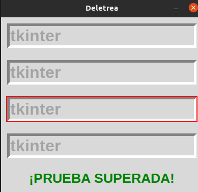

##  2. Metodos comunes 

## Deletreo
### Este programa consiste en completar la frase tkinter en cada una de las celdas en las que rota la celda de manera aleatoria para volverla  entretenida 

## posicion de raton 
### Este programa nos ayuda a saber la posicion exacta en donde se encuenta ubicado el cursor del mouse 

## Temporizadores 
### En este programa se puede apreciar como hace zoom y como disminuye de manera continua hasta no cerrar la ventana.

